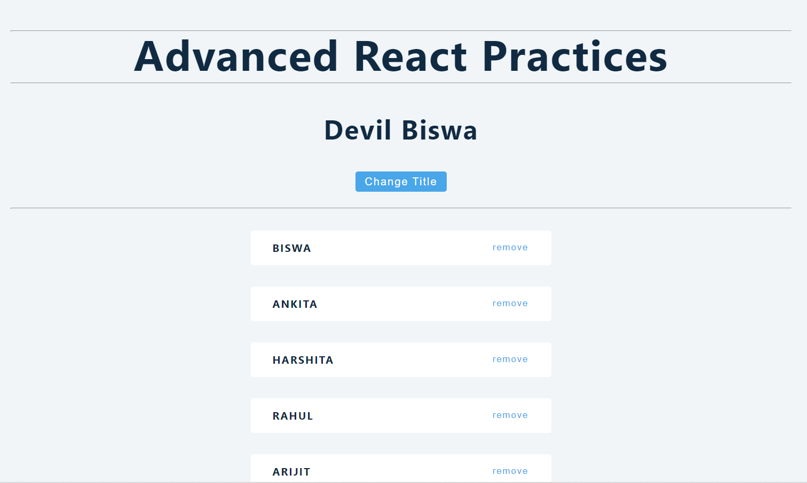
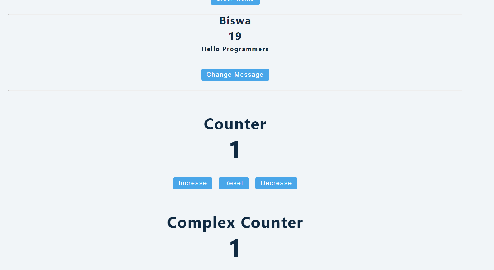
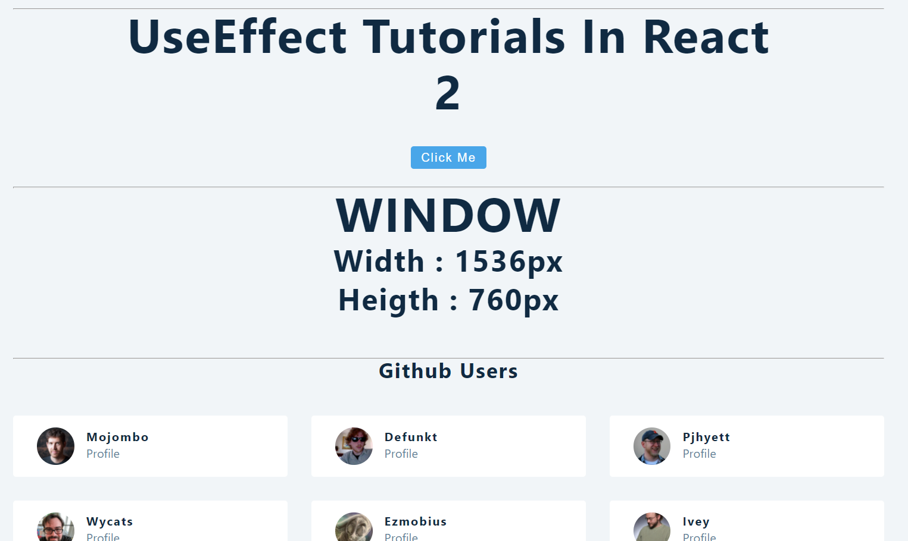
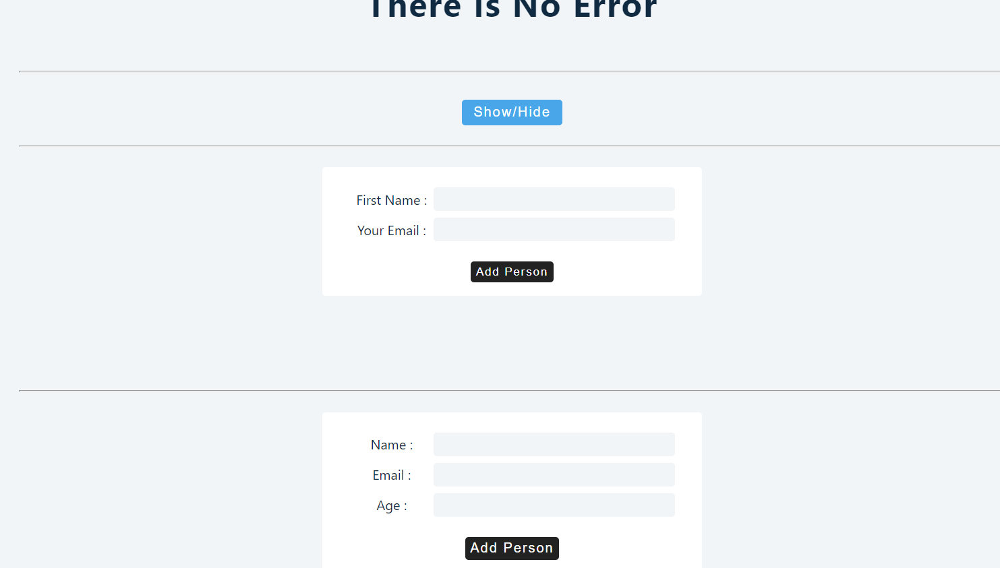
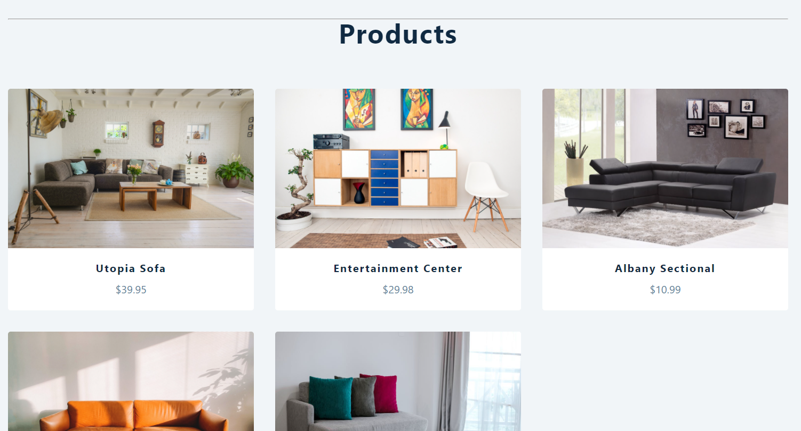

## REACT-ADVANCE-PRACTICES :star_struck: 

[](https://shields.io/) [](https://shields.io/) [](https://shields.io/)

***This new WebSite named 'REACT-ADVANCE-PRACTICES' is created by Biswarup Bhattacharjee, student of BTECH, in University of Engineering and Management, Kolkata.***

**Email Id: bbiswa471@gmail.com.** 

**Contact No: 916290272740.** 

<p align="left">
<a href="https://www.facebook.com/profile.php?id=100070395300810" target="blank"></a>
<a href="https://instagram.com/biswarup2210" target="blank"></a>
<a href="https://github.com/biswa2210/biswa2210" target="blank"></a>
</p>

## About :point_down: 

This is a website named 'REACT-ADVANCE-PRACTICE' which is created using react concepts. At first there is a change title option which changes the name between Devil Biswa and Biswarup Bhattacharjee. Then there is a list of names. Using Clear Items the list can be cleared. Then there is a change message option which changes the message between Hello guys and Hello Programmers. Then there is a counter with increase, reset and decrease options. There is also complex counter. Then there is use effect hook. The window height and width are shown here. Then there is a list of github users. Then there is toggle error option which changes error status. Then there are options to add person by adding name and email id. Then there is prop drilling.  Then there are some data or products. Basically this is a practice of react concepts.

## LINK of full project: :point_right: https://react-advance-practices.netlify.app/. 

## Folder Structure :point_down:

```bash
react-advance-practices
   ├── public
   |      └── index.html
   └── src
        ├── App.js
        ├── data.js
        ├── index.css
        └── index.js
```   
      
## Making :point_down:

I have made this uing react concepts.

#### useState

1. Birthday Reminder

#### useEffect and Conditional Rendering

2. Tours
3. Reviews
4. Accordion
5. Menu
6. Tabs
7. Slider

#### Forms

8. Lorem Ipsum Generator
9. Color Shades Generator
10. Grocery Bud

#### useRef

11. Navbar

#### useContext

12. Modal and Sidebar
13. Stripe Menus

#### useReducer and useContext

14. Cart


## Screenshots :point_down: 

<div align="center">
 
<a href="ad1.png"></a> 
  
<a href="ad2.png"></a> 
  
<a href="ad3.png"></a> 
   
<a href="ad4.png"></a> 
   
<a href="ad5.png"></a> 

</div>


